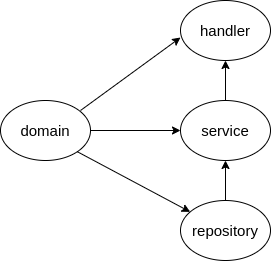
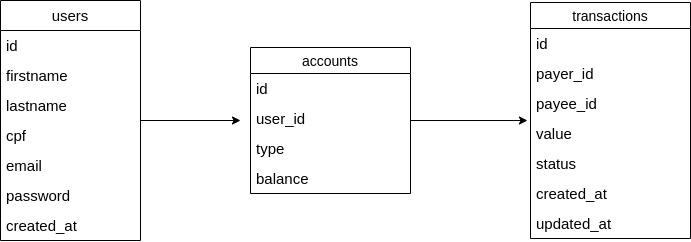

# Bank Transaction
API Restful que permite usuário se cadastrar e realizar transações bancárias

## Stack

- `Golang`
- `Fiber`
- `Mysql`
- `RabbitMQ`
- `Redis`

## User Guide
<details>
    <summary>Roadmap do usuário</summary>

    - Usuário pode se cadastrar
    - Usuário pode efetuar login
    - Usuário logado pode efetuar transação
</details>

## Arquitetura & Decisões

- #### Web framework
    A escolha do framework `Fiber` se deve a sua simplicidade e features que facilitam o desenvolvimento.
    Sendo as principais: Fácil roteamento, Tratamento de erro, Validação de input. Entre outras(CORS, autenticação de endpoints, *middlewares*). É sabido que desenvolvedores `Go` não ~~costumam~~ utilizar *web frameworks*, porém o escolhido ajuda a economizar tempo e se encaixa bem aos requisitos da aplicação. Visto que o mesmo é simples, assim como o Express(NodeJS).

- #### Acompanhamento e Status
    O `Redis` está sendo utilizado para persistir *status* do processamento, que pode ser utilizado para o acompanhamento do processo.

- #### O *message broker*
    Devido a simplicidade dos requisitos para essa aplicação, o *message broker* pode se tornar uma ferramenta que acrescenta mais complexidade do que benefícios. Porém, o uso do mesmo está relacionado a manter uma única fila de transações e garantir uma por usuário, além de permitir o acompanhamento do processo em tempo real.

- #### `RabbitMQ`
    Além da familiaridade ferramenta, o `RabbitMQ` é a melhor opção para a aplicação por ser leve e robusto. A utilização do `Redis` como *message broker* poderia ser cogitada, porém a segurança e garantia de entrega do `RabbitMQ` supera a opção do banco de dados(cache).

- #### Banco de Dados
    O escopo bem definido e a simplicidade da API não necessitam de um banco de dados robusto, logo o `MySQL` atende bem as necessidades da aplicação.

#### Estrutura

A estrutura é influenciada pelo [golang project layout](https://github.com/golang-standards/project-layout)

```
├── cmd
├── internal
│   ├── config
│   │   ├── router
│   └── modules
│       ├── transaction
│       ├── transfer
│       ├── account
│           ├── domain
│           ├── repository
│           ├── service
│           ├── handler
├── pkg
└── docs
```

### Sobre

##### Packages Diagram

> A setinha aponta para qual pacote será injetado ou importado

Os pacote foram pensados e organizados para evitar *imports cycles*, que ocasionam em error no `Go`, e desacoplar resposabilidades. Na qual, são utilizadas *ports* que fornecem uma interface do que é necessário para aquele determinado pacote e a implementação é injetada via injeção de dependências.

##### Class Diagram


Exemplo visual da Modelagem de dados(e classes) dentro da aplicação

### Endpoints

| endpoint | method | description |
| -------- | ------ | --------- | 
| `/accounts` | POST | Cria conta do usuário | 
| `/accounts/auth` | POST | Autenticar usuário e gerar JWT | 
| `/transactions` | POST | Criar transacão | 
| `/transactions/:id` | GET | Acompanhar transacão | 
    
### Fluxo

- #### `/transaction`
    - Usuário autenticado realiza transação
    - Endpoint retorna que solicitação foi criada, junto com *status code*`202` e *hateoas* para acompanhar o processo, através de *short polling*(no frontend) ou requisição `GET` no endpoint 
    - Solicitação é enviada para uma fila(`RabbitMQ`) e *status* é persistido no `Redis`
    - Ao consumir evento da fila, atualiza *status* do processamento(que pode ser consultado pelo endpoint `/transaction/:id` através de *short polling* para acompanhamento em tempo real).
    - Processa solicitação
        * Verifica se conta de usuário(*payee*) existe
        * Verifica o tipo de conta do usuário(*payer*)
        * Verifica saldo
        * Consulta serviço autorizador(*mock*)
        * Atualiza saldo de contas
    - Atualiza *status* do processamento
    - Em caso de erro, realizar *rollback* e atualizar *status*
    - Todas as transações bem sucedida(ou não) são registradas

---

## Setup
É necessário criar uma cópia de `.env.example`(ou alterar o nome do arquivo atual) para `.env`

``` bash
mv .env.example .env
// ou
cp .env.example .env
```

Em seguida atualizar os valores das variáveis

#### Run
Com o *docker compose* instalado execute:
``` sh
docker compose up --build -d
```
<details>
    <summary>Acompanhar logs</summary>

    
    ``` sh
    docker compose logs api -f
    ```

</details>

### Tests
Com o `Go` instalado, execute:
``` sh
go test ./...
```
> o projeto foi desenvolvido utilizando a versão `1.19`
